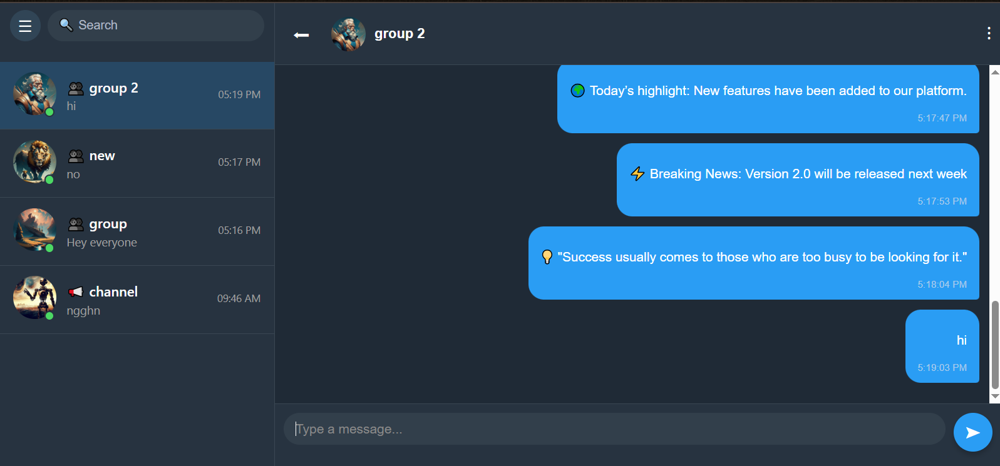

# Chat Application  

A **real-time chat application** built with **Django (backend)** and **React (frontend)**.  
Real-time communication is powered by **Django Channels**, **WebSockets**, and **Redis**.  

---

## 📸 Screenshots  

- Chat list and chat room  
  

---

## 🚀 Features  
- User authentication (signup & login)  
- Contact list and user search  
- Channel and group chats  
- Channel and group creation  
- Manage group members  
- Update room information and avatars  
- **WebSocket** support for instant messaging  

---

## 🛠 Tech Stack  
- **Backend:** Django, Django REST Framework, Django Channels, Redis  
- **Frontend:** React, Redux Toolkit  
- **Database:** PostgreSQL  
- **Reverse Proxy:** Nginx  
- **Containerization:** Docker & Docker Compose  

---

## ⚙️ Setup  

### 1. Clone the repository  
```bash
git clone https://github.com/alivssut/chat.git
```

### 2. Start the containers with Docker Compose
```bash
docker-compose up --build
```
### 3. Apply database migrations
```bash
docker-compose exec backend-1 python manage.py migrate
```
### 4. Create a superuser
```bash
docker-compose exec backend-1 python manage.py createsuperuser
```